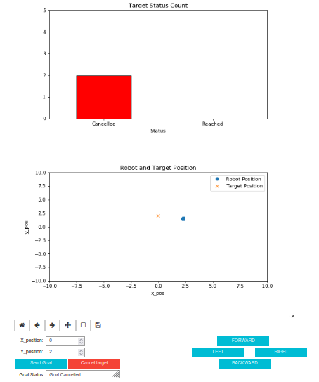
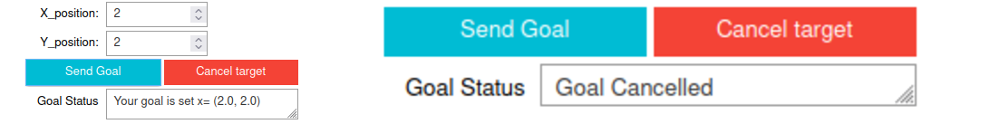
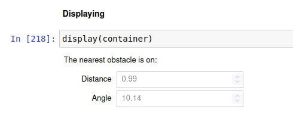

# RT2-Assignments

This repository contains the Research Track 2 Assignments, which consist of 3 individual assignments.

Student: Hocine DELALA, ID: 5445123.

## Table of Contents

- [Part 1: Documentation of RT1 Second Assignment](#part-1-documentation-of-rt1-second-assignment)
- [Jupyter Notebook Assignment](#jupyter-notebook-assignment)
- [Statistical Analysis](#statistical-analysis)
- [Conclusion](#conclusion)

## Part 1: Documentation of RT1 Second Assignment

For this part of the assignment, I created the documentation for the first semester assignment using Sphinx. Sphinx is a powerful documentation generation tool that allows for the creation of structured and well-formatted documentation for codebases. The documentation is written using reStructuredText (reST) markup language and can be transformed into various output formats such as HTML, PDF, and ePub.

To set up Sphinx for my project, I followed these steps:

1. Installed Sphinx by following the steps provided in the lecture or the official Sphinx website.
2. Initialized Sphinx by running `sphinx-quickstart` in the terminal from the root directory of the package I wanted to document. This command created a `source` directory containing the configuration file (`conf.py`) and the main documentation file (`index.rst`).
3. Wrote the documentation by editing the `index.rst` file in the `source` directory. Sphinx provides various directives and markup syntax for structuring the documentation.
4. Built the documentation by running `make html` in the terminal from the root directory of my project. This command generated the HTML output in the `build` directory.
5. Viewed the documentation by opening the generated HTML files in a web browser.

After completing these steps, I committed the changes to my GitHub repository and created a link to the documentation.

##### Link to the documentation:

[RT1 Second Assignment Documentation](https://hocinedl.github.io/RT1_2nd_Assignment_Documented/)

## Jupyter Notebook Assignment

Jupyter Notebook is an open-source web application that allows for the creation and sharing of documents containing live code, equations, widgets, animation, visualizations, and explanatory text.

In this assignment, I implemented a Jupyter Notebook-based user interface for the second assignment of the RT1 course. The goal was to replace the existing user interface node with an interactive notebook that provides real-time information about the robot's position, targets, closest obstacle distance, and target tracking status. The notebook utilizes widgets for user interaction and incorporates plots to visualize the robot's position, path to target positions, laser scanner information, and the number of reached and not-reached targets.

**HOW TO START THE NOTEBOOK**
1. Create a workspace or in any workspace, go to the src folder and clone my repository that contains two packages: the pachage given by the prof **assignmet_2_2022** which contains the launch file needed to start everything and the package I created **assignmentpackage**.
2. Launch everything using the commande :
```python
roslaunch assignment_2_2022 assignment11.launch
```
3. Download the notebook file **assignment-notebook** and run the notebook using : 
```python
jupyter-notebook --allow-root
```
4. From the jupyter **Run All Cells**, the cell before the last will display the folowing interface:   


<p align="center">
  
</p>

5. From this interface you have the possibility to move the robot in different direction and see its path thanks to the position plot, also you can set a target and the robot to that target and you can cancel it any time you want, you can also see the bar chart for the reached and calceled targets. For the distance from the nearest obstacle, it is displayed in the last cell.

### Implementation:

To achieve the desired functionality, the notebook leverages various libraries and techniques. The matplotlib and FuncAnimation libraries were used for creating interactive plots, while the rospy library enables communication with the robot's navigation system. The nav_msgs.msg module is employed to subscribe to topics such as Odometry and LaserScan, providing access to the robot's position and laser scanner data.
these are the used libruaries and dependancies: 

```python
from ipywidgets import VBox,HBox
import ipywidgets as widgets
import jupyros as jr
import rospy
from IPython.display import display, clear_output
import time
import numpy as np
from nav_msgs.msg import Odometry
from geometry_msgs.msg import  Twist
from assignmentpackage.srv import my_service, my_serviceResponse
from sensor_msgs.msg import LaserScan 
from assignment_2_2022.msg import PlanningAction, PlanningGoal
from assignment_2_2022.msg import  PlanningActionResult, PlanningActionGoal,PlanningActionFeedback
from geometry_msgs.msg import PoseStamped
%matplotlib notebook
import matplotlib.pyplot as plt
from matplotlib.animation import FuncAnimation


```


### User Interaction

To facilitate user control over the robot's movement, the notebook includes buttons for various motion commands. These buttons allow users to start, stop, and modify the robot's behavior within the environment. The notebook ensures that the robot's position and target tracking information are consistently updated to reflect any changes initiated by the user. I used four buttons to direct the robot in different directions and provided an interface to set a desired goal and send or cancel the target.

<p align="center">
  
</p>

### Position and Target Tracking

This part provides a visual representation of the robot's position and target positions. It subscribes to relevant topics to receive position and status information and updates the plot accordingly. The use of `FuncAnimation` enables real-time updates and animation of the plot.

When the cell is executed, it displays a circle representing the robot's position. For example:


<p align="center">
  
</p>

When the user enters a target position and clicks on "Send Goal," a cross indicating the target (goal) position is displayed. For example:


<p align="center">
  
</p>


At the same time, the robot starts moving toward the target position, creating a path. For example:

<p align="center">
  
</p>
I tested my code multiple times, and here is an example of the robot's path when it tries to avoid an obstacle to reach a target:

<p align="center">
  
</p>

I also added a text box to show the state of the goal. When the user sets a goal, it displays a message indicating the goal, and if the user cancels the goal, it shows a message canceling the goal.



### Target Tracking Status

The notebook incorporates a bar chart to represent the number of reached and not-reached targets. The chart is updated in real-time based on feedback received from the robot's goal action client. Each bar represents a target status category ("Reached" and "Cancelled"), and the height of the bars reflects the corresponding count of targets in each category.

<p align="center">
  
</p>

### Closest Obstacle Distance

To provide information about the closest obstacle, the notebook utilizes the laser scanner data. The distance to the nearest obstacle is calculated and displayed in a text box. The laser scanner information is processed, and the values from the topic are used to retrieve the distance to the nearest obstacle and calculate the angle to that obstacle. The widgets display the following:


<p align="center">
  
</p>


### Conclusion

In conclusion, my Jupyter Notebook provides an intuitive and interactive environment for monitoring the robot's position, target tracking status, and closest obstacle distance. The use of widgets and visualizations enhances the user experience by presenting relevant information in a clear and concise manner. By replacing the original user interface node with this notebook, the process of controlling and tracking the robot's movement becomes more accessible and efficient.


