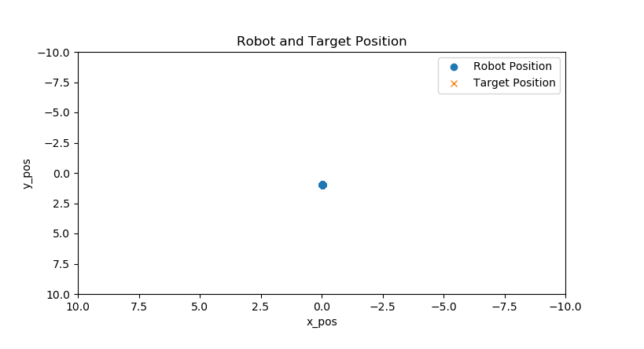

# RT2-Assignments

This repository for Research Track 2 Assignmen which is a collection of 3 individual assignments.

Student: Hocine DELALA, id: 5445123.

## Table of Contents

- [Part1 Documentation of RT1 Second Assignment](#part1-documentation-of-rt1-second-assignment)
- [Jupyter Notebook Assignment](#jupyter-notebook-assignment)
- [Statistical Analysis](#statistical-analysis)
- [Conclusion](#conclusion)

## Part1 Documentation of RT1 Second Assignment

For this part of the assignment, it was simply [the documentation](https://hocinedl.github.io/RT1_2nd_Assignment_Documented/) of the first semester assignment, I used Sphinx.

Sphinx is a powerful documentation generation tool that allowed me to create structured and well-formatted documentation for my codebase. Sphinx uses reStructuredText (reST) markup language to write the documentation, which is then transformed into various output formats such as HTML, PDF, and ePub.

To set up Sphinx for my project, I followed these steps:

1. Installing Sphinx: Following the steps giving in the lecture or following the steps in its website.
2. Initializing Sphinx: To initialize sphinx, we need to open the terminal in the root directory of the package we want to document and run `sphinx-quickstart`.  This command will create a `source` directory containing the configuration file (`conf.py`) and the main documentation file (`index.rst`).
3. Writing the documentation: Open the `index.rst` file in the `source` directory and start documenting your project. Sphinx provides various directives and markup syntax to structure your documentation.
4. Building the documentation: Once I finished  writting the documentation, I navigate to the root directory of my project in the terminal and run `make html`. Sphinx will generate the HTML output in the `build` directory.
5. View the documentation: Open the generated HTML files in a web browser to view the documentation.

After finishing these steps, I commited the changes on my github repository and created a link to the documentaion.

##### The link for the docmentation

https://hocinedl.github.io/RT1_2nd_Assignment_Documented/


## Jupyter Notebook Assignment


   Jupyter Notebook is an open-source web application that allows you to create and share documents containing live code, equations, widgets,animation and visualizations, and explanatory text. 

   In this assignment,I implemented a Jupyter Notebook-based user interface for the second assignment of the course RT1. The goal was to replace the existing user interface node with an interactive notebook that provides real-time information about the robot's position, targets, closest obstacle distance, and target tracking status. The notebook utilizes widgets for user interaction and incorporates plots to visualize the robot's position, path of the robot when going to target positions, laser scanner information, and the number of reached and not-reached targets.


### Implementation:


To achieve the desired functionality, the notebook leverages various libraries and techniques. The matplotlib and FuncAnimation libraries were used for creating interactive plots, while the rospy library enables communication with the robot's navigation system. The nav_msgs.msg module is employed to subscribe to topics such as Odometry and LaserScan, providing access to the robot's position and laser scanner data.
these are the used libruaries and dependancies: 

```python
from ipywidgets import VBox,HBox
import ipywidgets as widgets
import jupyros as jr
import rospy
from IPython.display import display, clear_output
import time
import numpy as np
from nav_msgs.msg import Odometry
from geometry_msgs.msg import  Twist
from assignmentpackage.srv import my_service, my_serviceResponse
from sensor_msgs.msg import LaserScan 
from assignment_2_2022.msg import PlanningAction, PlanningGoal
from assignment_2_2022.msg import  PlanningActionResult, PlanningActionGoal,PlanningActionFeedback
from geometry_msgs.msg import PoseStamped
%matplotlib notebook
import matplotlib.pyplot as plt
from matplotlib.animation import FuncAnimation


```

### User Interaction:


   To facilitate user control over the robot's movement, the notebook includes buttons for various motion commands. These buttons allow users to start, stop, and modify the robot's behavior within the environment. The notebook ensures that the robot's position and target tracking information are consistently updated to reflect any changes initiated by the user. I used 4 buttons to direct the robot in different directions, and also an interface to set a desired goal and send it or cancel the target.


### Position and Target Tracking:

This part provides a visual representation of the robot's position, target positions. It subscribes to relevant topics to receive position and status information, and updates the plot accordingly. The use of FuncAnimation enables real-time updates and animation of the plot.

When we run the cell it shows cirle representing the robot, as shown here:


When the user enter a target position and click on (Send Goal), it creates a crox indicating the target (goal) position, as shown here :


in the same time the robot starts moving toward the target pos creating a path, as in this example:


I tried to test my code multiple times and i got this robot path when it tries to avoid an obstacle to reach a target:


I also added a textBox to show the state of the goal, when the user set a goal it displays a message indicating the goal and if he cancels the goal it shows a message canceling a goal.

<div style="display: flex;">
  
  
</div>


### Target Tracking Status:

The notebook incorporates a bar chart to represent the number of reached and not-reached targets. The chart is updated in real-time based on feedback received from the robot's goal action client. Each bar represents a target status category ("Reached" and "Cancelled"), and the height of the bars reflects the corresponding count of targets in each category.


### Closest Obstacle Distance:

To provide information about the closest obstacle, the notebook utilizes the laser scanner data. The distance to the nearest obstacle is calculated and displayed in a text box. The laser scanner information is visualized either as a separate plot or as part of the main plot, depending on the chosen implementation.


In conclusion, my jupyter-Notebook provides an intuitive and interactive environment for monitoring the robot's position, target tracking status, and closest obstacle distance. The use of widgets and visualizations enhances the user experience by presenting relevant information in a clear and concise manner. By replacing the original user interface node with this notebook, the process of controlling and tracking the robot's movement becomes more accessible and efficient.


## Statistical Analysis

The third part of this assignment focuses on statistical analysis. Statistical analysis involves collecting, organizing, analyzing, and interpreting data to uncover patterns, relationships, and insights. It enables you to draw meaningful conclusions from data and make informed decisions.

To perform statistical analysis, follow these general steps:

1. Define your research question or objective: Clearly state the question or objective that you want to address through statistical analysis.
2. Collect and prepare the data: Gather the relevant data


